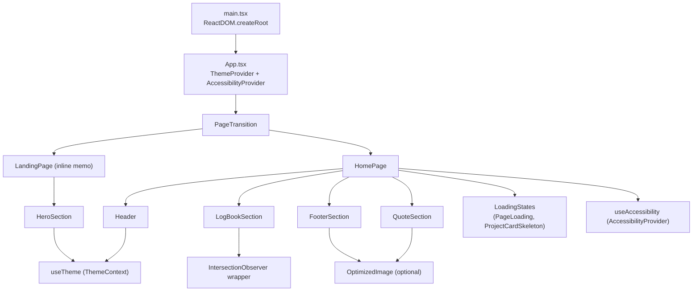

## game plan
- Categorize third‑party packages from package.json.
- Map the runtime import graph from entrypoint → providers → feature sections.
- Highlight how shared utilities and UI primitives fit in.

## external dependencies

| Category | Packages | Purpose |
| --- | --- | --- |
| React core | `react`, `react-dom` | SPA rendering and hooks. |
| Build tooling | `vite`, `@vitejs/plugin-react-swc`, `@types/node` | Dev server, bundling, type stubs. |
| Design system (Radix) | `@radix-ui/react-*` (accordion, dialog, dropdown-menu, tooltip, etc.), `vaul` | Accessible headless UI primitives underpinning `components/ui/*`. |
| Styling helpers | `class-variance-authority`, `clsx`, `tailwind-merge` | Compose Tailwind class variants and merge class names. |
| Icons & visuals | `lucide-react`, `embla-carousel-react`, `recharts` | Icons, carousel, charts for advanced UI. |
| Forms & input | `react-hook-form`, `react-day-picker`, `input-otp`, `cmdk` | Form handling, date pickers, command palette, OTP inputs. |
| Theming/accessibility | `next-themes`, `sonner` | Theme detection (wrapped by custom context), toast notifications. |
| Layout utilities | `react-resizable-panels` | Resizable panel UI. |

*(`next-themes`, `embla-carousel-react`, `recharts`, etc., aren’t referenced yet in main screens, but are available for the UI kit modules under `components/ui/`.)*

## internal module graph

```
main.tsx
└── App.tsx
    ├── ThemeProvider (ThemeContext.tsx)
    │   └── Updates <html> classes + localStorage
    ├── AccessibilityProvider
    │   ├── Exposes useAccessibility()
    │   └── Injects skip link + live region
    ├── PageTransition
    │   └── Wraps current page with overlay + aria feedback
    ├── LandingPage (inline memo component)
    │   └── HeroSection
    │       └── useTheme (logo swap), cloud animation
    └── HomePage
        ├── useAccessibility (for announcements/motion)
        ├── LoadingStates (PageLoading, ProjectCardSkeleton)
        ├── Header
        │   └── useTheme (theme toggle, smooth scroll)
        ├── QuoteSection
        ├── LogBookSection
        │   └── IntersectionObserver
      └── FooterSection
```

### shared utilities

- IntersectionObserver.tsx wraps native observers with fallbacks; drives entrance animations in `LogBookSection` (and available for others).
- `components/OptimizedImage.tsx` provides a cached image loader leveraging promises and blur placeholders.
- ThemeContext.tsx and AccessibilityProvider.tsx are consumed by multiple sections to align UI/UX with user preferences.

### shadcn-style UI kit (`components/ui/`)

Each file exports a Radix-backed primitive (e.g., button.tsx -> `Button`, `dialog.tsx` -> `Dialog`). They all import:

- `@radix-ui/react-*` modules for accessibility behaviors.
- `cn()` from utils.ts (which uses `clsx` + `tailwind-merge`).

These components are ready to be pulled into future feature screens; current landing/home screens mostly rely on bespoke markup.

## doc & style dependencies

- `styles/globals.css` defines the design tokens and custom classes referenced across components (`landing-page-wrapper`, `scroll-progress`, etc.).
- Documentation files (`Attributions.md`, `OPTIMIZATION_RESULTS.md`, `optimization-checklist.md`, `guidelines/Guidelines.md`) give context for design choices and performance work—no runtime imports, but useful for onboarding.

## quality gates

- Build/Lint/Tests: not run (analysis only).

---

Creating a mermaid dependency diagram for the app structure and sharing it below; the chart maps the primary runtime flow from `main.tsx` through the feature components.

## diagrams

### core runtime



