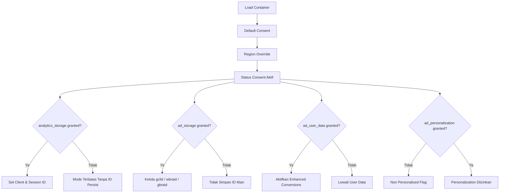
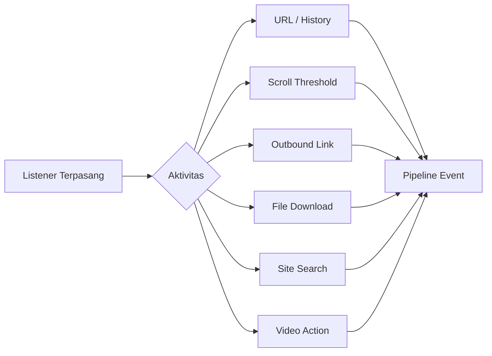
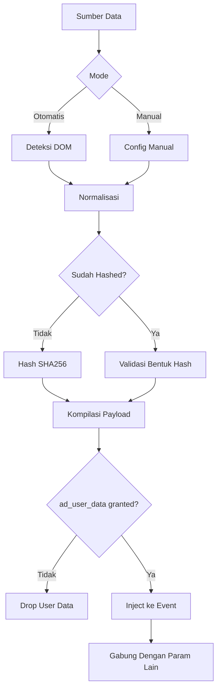
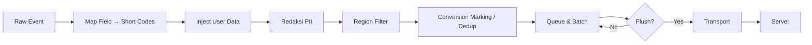
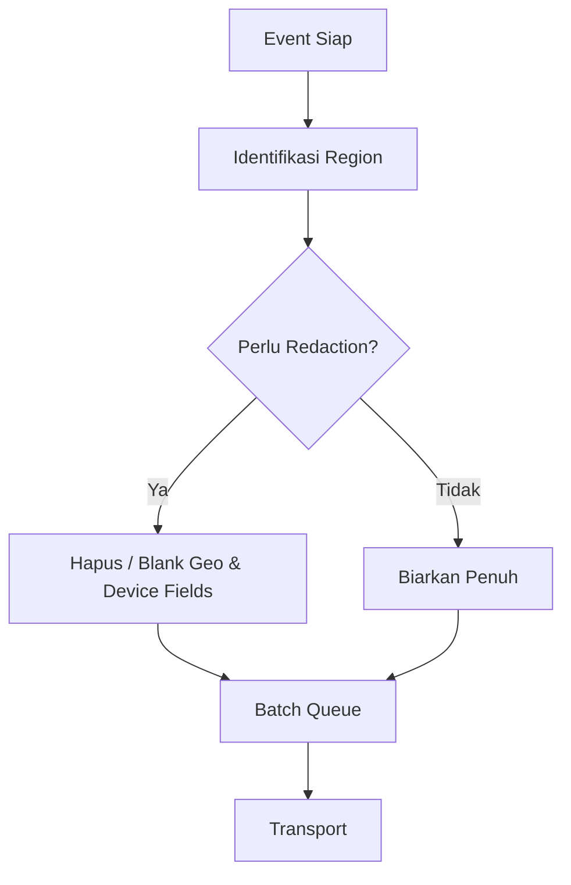
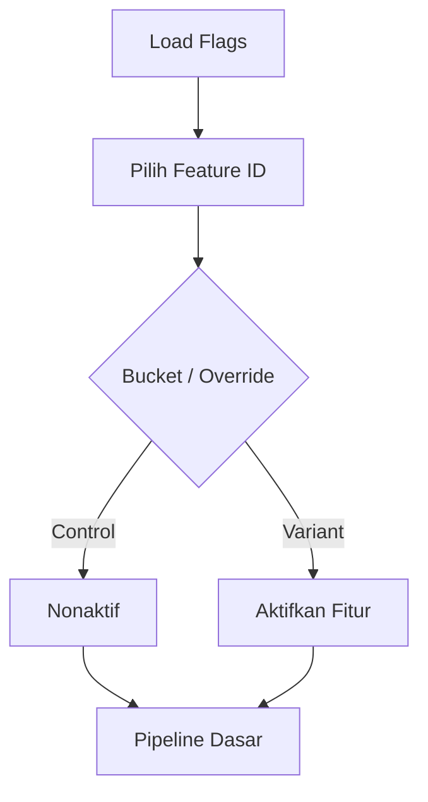
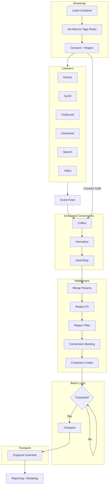
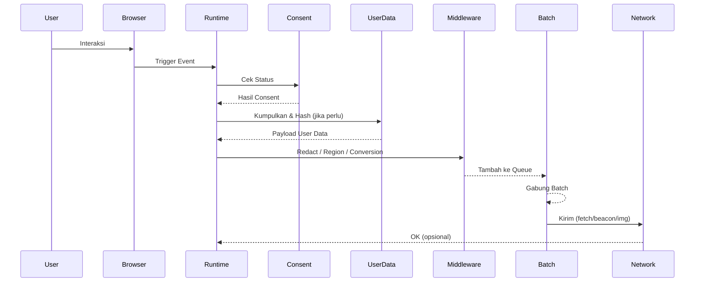

Berikut versi diagram Mermaid yang sudah diperbaiki (tanpa ` `, tanpa karakter yang sering memicu parse error, label dipersingkat, dan setiap node punya ID jelas). Silakan salin persis tiap blok kode. Jika masih ada error di environment Anda, cek versi Mermaid (disarankan ≥ 9.4) dan pastikan tidak ada trimming otomatis oleh CMS/editor.

1. Alur Tingkat Tinggi (High-Level Lifecycle)

```mermaid
flowchart LR
    A[Load Bootstrap] --> B[Init Macros Tags Rules]
    B --> C[Evaluate Consent default region]
    C --> D{Consent OK}
    D -- No --> P[Park Event Wait]
    D -- Yes --> E[Attach EM Listeners]
    P --> |Consent Updated| F
    E --> F[Event Fires]
    F --> G[Normalize Hash User Data]
    G --> H[PII Redaction]
    H --> I[Conversion Marking]
    I --> J[Region Field Filter]
    J --> K[Batch Queue]
    K --> L{Flush}
    L -- No --> K
    L -- Yes --> M[Transport fetch beacon img]
    M --> N[GA4 Ads Endpoint]
    N --> O[Reporting Analytics]
```

2. Detail Consent Mode & Pengaruhnya

3. Enhanced Measurement Event Flow

4. Enhanced Conversions (User Data) Pipeline

5. Middleware / Transform Pipeline (Event-Level)

7. Region Scoping & Redaction

9. Eksperimen / Feature Flags

10. Diagram Integratif (Semua Layer)

11. (Opsional) Sequence End-to-End (Jika butuh tipe sequence, ini tetap valid)

